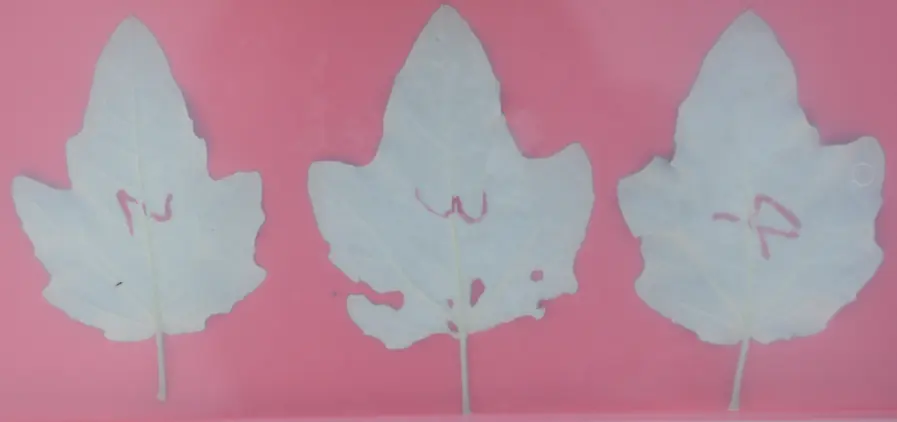
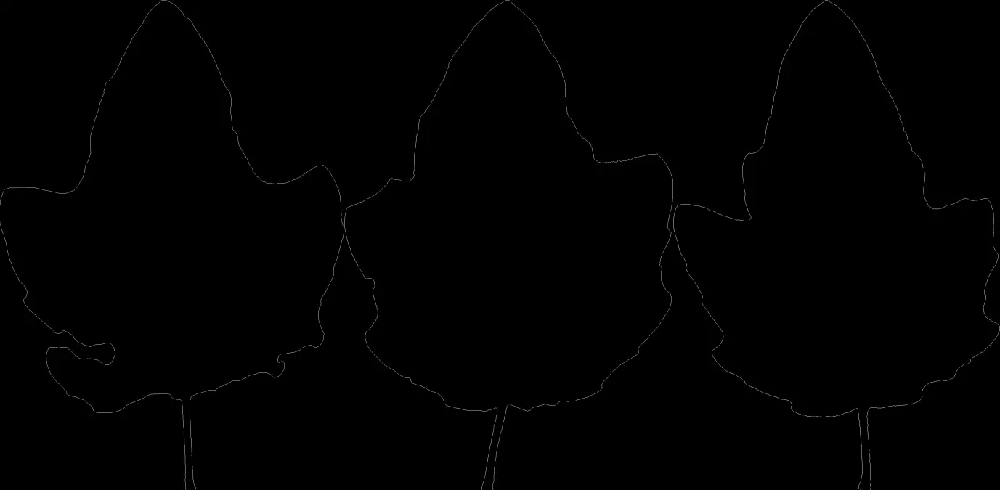
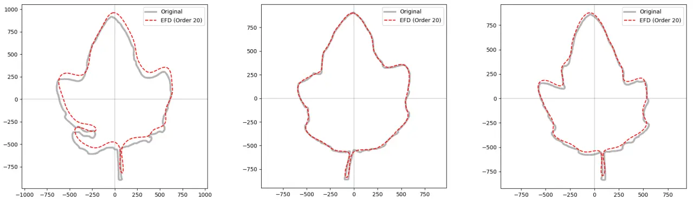

# Fourier Descriptor

## Background

椭圆傅里叶描述子（Elliptic Fourier Descriptors, EFD）是将闭合轮廓（如叶片）转换为一组数值特征的核心算法。它通过将二维轮廓分解为多个椭圆谐波的叠加，实现形状的精确数字化。椭圆傅里叶描述子（Elliptical Fourier Descriptors, EFDs）是一种强大的数学工具，通过将闭合曲线分解为一系列椭圆函数（傅里叶级数）的系数来表示其形状，实现对复杂边界的特征提取与识别，具有平移、旋转、缩放不变性，能高精度描述不规则形状，常用于计算机视觉、图像处理（如生物特征识别、形状分析、机械设计等）中的轮廓分析与匹配。此处以将叶片进行数值化为例来进行解释。

## 叶片轮廓提取



先从相机拍摄的图片中将叶片的轮廓提取出来，首先要对图片进行降噪处理，平滑图像以去除传感器噪声或微小的表面纹理（如叶脉干扰）。使用二维高斯核 $G(x, y)$ 与图像进行卷积。核函数公式为：
$$G(x, y) = \frac{1}{2\pi\sigma^2} e^{-\frac{x^2+y^2}{2\sigma^2}}$$
使用 $(5, 5)$ 的核大小，这意味着每个像素的值会被周围 25 个像素的加权平均值替换。

```python
img = cv2.imread(input_path)
blurred = cv2.GaussianBlur(img, (5, 5), 0)
```

根据颜色来提取绿色叶片，相比 RGB，Lab 空间实现了亮度（L）与颜色（a, b）的分离。

-   a 通道：代表从绿色（负值）到红色（正值）的分量。
- 逻辑：绿色叶片在 a 通道中的数值非常低。通过提取 a 通道，可以将“绿色”这一特征转化为极高对比度的灰度图。

```python

lab = cv2.cvtColor(blurred, cv2.COLOR_BGR2Lab)
l_channel, a_channel, b_channel = cv2.split(lab) # 仅保留 a 进一步处理
```

将灰度图转化为二值图（黑白图），确定哪些像素属于叶片，哪些属于背景。Otsu 算法通过迭代计算，寻找一个最佳阈值 $t$，使得前景和背景的类间方差最大化：
$$\sigma_b^2(t) = \omega_0(t)\omega_1(t)[\mu_0(t) - \mu_1(t)]^2$$
其中 $\omega$ 是像素概率，$\mu$ 是平均灰度。
由于在 a 通道中绿色是暗色（低值），使用 `THRESH_BINARY_INV` 将暗色区域（叶片）翻转为白色（255）。

```python
_, binary = cv2.threshold(a_channel, 0, 255, cv2.THRESH_BINARY_INV + cv2.THRESH_OTSU)
```

二值化后，图像可能存在杂点或孔洞，需要通过形态学运算修复。

设 $A$ 为图像，$B$ 为结构元素（椭圆核）：

- 开运算（Opening）：先腐蚀后膨胀，消除孤立的小白点。
    $$A \circ B = (A \ominus B) \oplus B$$
- 闭运算（Closing）：先膨胀后腐蚀，填充叶片内部的小黑洞。
    $$A \bullet B = (A \oplus B) \ominus B$$

```python
kernel = cv2.getStructuringElement(cv2.MORPH_ELLIPSE, (3, 3))
binary = cv2.morphologyEx(binary, cv2.MORPH_OPEN, kernel, iterations=2)
binary = cv2.morphologyEx(binary, cv2.MORPH_CLOSE, kernel, iterations=2)
```

现在可以进行检验，通过四个维度判断一个轮廓是否为真正的“叶片”。

- 面积占比：过滤掉相机镜头上的灰尘（过小）或整个背景块（过大）。
    $$Area_{min} = H \times W \times 0.0005$$

- 填充率 (Extent)：如果 Extent 接近 1.0 且 Solidity 高，说明该物体是一个矩形（通常是标签或背景边缘），将其跳过。
    $$Extent = \frac{Area_{轮廓}}{w \times h (外接矩形面积)}$$

- 紧凑度 (Solidity)：凸包（Convex Hull）是包裹轮廓的最小凸多边形。叶片通常有一定凹凸感，而背景杂质（如正方形纸片）的 Solidity 极高。
    $$Solidity = \frac{Area_{轮廓}}{Area_{凸包}}$$

- 宽高比 (Aspect Ratio)：过滤掉长宽极度失调的直线或细长划痕（$AR > 5.0$ 或 $AR < 0.2$）。
    $$AR = \frac{Width}{Height}$$

```python
# 计算外接矩形与凸包
x, y, w, h = cv2.boundingRect(cnt)
hull = cv2.convexHull(cnt)
# 执行筛选逻辑
if extent > 0.90 and solidity > 0.95: continue
if aspect_ratio > 5.0 or aspect_ratio < 0.2: continue
```

将判断为叶片轮廓的图片输出，将轮廓坐标减去了外接矩形的左上角坐标 $(x, y)$：
$$x_{shifted} = x_{original} - x_{min}, \quad y_{shifted} = y_{original} - y_{min}$$
这样生成的图片只包含叶片本身，且叶片位于图片左上角。然后使用 `np.save` 将原始轮廓 `cnt` 保存。

```python
# 保存为 NumPy 二进制，供后续 EFD 调用
np.save(os.path.join(output_dir, f"{base_name}_{i+1}.npy"), cnt)
```

- 数据结构：一个形状为 $(K, 1, 2)$ 的数组，存储了 $K$ 个连续的边界坐标点。
- 与傅里叶的衔接：傅里叶脚本读取此文件后，会通过 `np.diff` 计算相邻两点间的距离 $\Delta t = \sqrt{\Delta x^2 + \Delta y^2}$。由于 `findContours` 提取的是连续有序的闭合曲线，这完美符合傅里叶级数对周期函数的要求。



## 椭圆傅里叶描述子

随后就可以通过椭圆傅里叶描述子对叶片进行数值化。首先需要消除叶片在图片中位置的影响，通过计算质心并平移，将轮廓中心移至原点。

设原始轮廓点集合为 $(x_i, y_i)$，质心坐标为：
$$\bar{x} = \frac{1}{K}\sum_{i=1}^{K} x_i, \quad \bar{y} = \frac{1}{K}\sum_{i=1}^{K} y_i$$
平移后的坐标：$x'_i = x_i - \bar{x}, \quad y'_i = y_i - \bar{y}$

```python
def establish_coordinate_system(npy_file):
    contour = np.load(npy_file).squeeze()
    centroid_x = np.mean(contour[:, 0])
    centroid_y = np.mean(contour[:, 1])
    centered_x = contour[:, 0] - centroid_x
    centered_y = (contour[:, 1] - centroid_y) * -1
    return np.stack([centered_x, centered_y], axis=1)
```

EFD 将轮廓看作随“时间” $t$ 变化的周期函数。$t$ 代表沿叶片边缘移动的累计长度。

相邻点间的距离（步长）为 $\Delta t_i$，总周长为 $T$：
$$\Delta x_i = x_i - x_{i-1}, \quad \Delta y_i = y_i - y_{i-1}$$
$$\Delta t_i = \sqrt{\Delta x_i^2 + \Delta y_i^2}, \quad T = \sum_{i=1}^{K} \Delta t_i$$

```python
dx = np.diff(contour[:, 0])
dy = np.diff(contour[:, 1])
dt = np.sqrt(dx2 + dy2)
t = np.concatenate(([0], np.cumsum(dt)))
T = t[-1]
```

每一阶谐波 $n$ 由四个系数 $(a_n, b_n, c_n, d_n)$ 组成，代表一个椭圆。多个椭圆叠加形成最终叶片形状。

利用 Kuhl 和 Giardina 提出的离散积分公式计算第 $n$ 阶系数：
$$a_n = \frac{T}{2n^2\pi^2} \sum_{i=1}^K \frac{\Delta x_i}{\Delta t_i} \left[ \cos \frac{2n\pi t_i}{T} - \cos \frac{2n\pi t_{i-1}}{T} \right]$$
（$b_n, c_n, d_n$ 公式结构类似，分别对应 $x$ 的正弦项、$y$ 的余弦项和 $y$ 的正弦项）

```python
for n in range(1, order + 1):
    const = T / (2 * (n * np.pi)2)
    phi_n = (2 * np.pi * t) / T * n
    d_cos_phi_n = np.cos(phi_n[1:]) - np.cos(phi_n[:-1])
    d_sin_phi_n = np.sin(phi_n[1:]) - np.sin(phi_n[:-1])

    an = const * np.sum((dx / dt) * d_cos_phi_n)
    bn = const * np.sum((dx / dt) * d_sin_phi_n)
    cn = const * np.sum((dy / dt) * d_cos_phi_n)
    dn = const * np.sum((dy / dt) * d_sin_phi_n)
    coeffs[n-1] = [an, bn, cn, dn]
```

为了让不同大小、不同摆放角度的叶片具有可比性，需要基于第一阶谐波（主椭圆）进行标准化。

1. 旋转归一化：通过 $\arctan2$ 计算第一阶椭圆的长轴角度 $\theta$，将形状旋转至水平。
2. 尺度归一化：计算第一阶椭圆的半长轴长度作为缩放因子 $L$，所有系数除以 $L$。

```python
a1, b1, c1, d1 = coeffs[0]
theta = 0.5 * np.arctan2(2 * (a1 * b1 + c1 * d1), (a12 + c12 - b12 - d12))
cost, sint = np.cos(theta), np.sin(theta)

a1_s = a1 * cost + c1 * sint
c1_s = -a1 * sint + c1 * cost
scale = np.sqrt(a1_s2 + c1_s2) # 计算缩放因子

# 对所有系数应用旋转矩阵并除以 scale
rot_matrix = np.array([[cost, sint], [-sint, cost]])

new_row = [vec_ac[0]/scale, vec_bd[0]/scale, vec_ac[1]/scale, vec_bd[1]/scale]
```

通过存储的系数，利用三角函数重新合成坐标点，用于验证数字化精度。

$$x(t) = \sum_{n=1}^N \left( a_n \cos \frac{2n\pi n t}{T} + b_n \sin \frac{2n\pi n t}{T} \right)$$
$$y(t) = \sum_{n=1}^N \left( c_n \cos \frac{2n\pi n t}{T} + d_n \sin \frac{2n\pi n t}{T} \right)$$

```python
def reconstruct(coeffs, num_points=300):
    t = np.linspace(0, 1.0, num_points)
    xt, yt = np.zeros(num_points), np.zeros(num_points)
    for n, (an, bn, cn, dn) in enumerate(coeffs):
        idx = n + 1
        xt += an * np.cos(2 * np.pi * idx * t) + bn * np.sin(2 * np.pi * idx * t)
        yt += cn * np.cos(2 * np.pi * idx * t) + dn * np.sin(2 * np.pi * idx * t)
    return np.stack([xt, yt], axis=1)
```


每个叶片轮廓被压缩为一个 $N \times 4$ 的矩阵（CSV 文件）：

-   $N$：谐波阶数（默认 20），决定了形状描述的精细程度。
-   4 个系数：每一行 $(a_n, b_n, c_n, d_n)$ 是该叶片的数字特征。

| an                        | bn                        | cn                        | dn                        |
| ------------------------- | ------------------------- | ------------------------- | ------------------------- |
| 7.488405675770083425e-01  | -4.579291267755849701e-03 | 9.514606951234022211e-03  | 1.000173476090894242e+00  |
| 5.826488222104586612e-02  | 8.580948869307536420e-02  | -1.289347572307253942e-01 | 5.914479572974669364e-02  |
| 5.991343946048102026e-02  | -2.693968072267126888e-03 | 6.387518434990185900e-02  | -7.612737481649442528e-02 |
| 5.589369320307229633e-02  | 6.485492853416166548e-02  | 4.587233142683490306e-02  | -1.964674800187007561e-02 |
| 3.012810106154244563e-02  | -8.115025308993023545e-02 | -3.057401602469080049e-02 | 9.329419426284259187e-02  |
| -5.429544110936265072e-02 | 5.792364746491207583e-02  | -5.820097200626377781e-02 | 3.293086414525490946e-02  |
| -4.995749344696494287e-03 | 3.186271461583466396e-03  | 2.345935992600788403e-02  | 3.643757077440067105e-02  |
| -1.765828398069931721e-02 | -1.293200581795036531e-02 | 1.141185691847673711e-02  | -2.663484592116941232e-02 |
| -6.714048488444037191e-03 | 2.124611739245981304e-02  | -1.916177797167296568e-02 | -2.792993249479538975e-02 |
| 1.187329330260135547e-02  | -2.113163284781805623e-02 | -2.666791953994123235e-02 | 1.376941857156592508e-02  |
| -2.195171256635094787e-03 | 1.119676778441518715e-02  | 1.489804031568636722e-02  | -1.358530963851384277e-02 |
| 4.843741985050618697e-03  | -1.439655734418070557e-02 | 1.565414398089504111e-02  | -2.512202300859972190e-03 |
| -8.382702241597910636e-03 | -5.117494976419121114e-03 | 3.117600233485684231e-03  | 6.194606879102540833e-03  |
| -7.703467494538939614e-03 | 7.479888621184830645e-03  | 7.215306159337807161e-03  | -4.057907168150296992e-03 |
| -1.204495903353998681e-03 | 3.446388825115624470e-04  | -2.264538684982632215e-03 | 6.998163061544384993e-03  |
| -3.324391970025497318e-03 | 2.293509520386948376e-03  | 7.043222466077834337e-03  | 6.923037343212753514e-04  |
| -6.743970845658214417e-04 | 1.907044498310364209e-03  | -2.291976913341352458e-03 | 5.895386745154647043e-03  |
| -3.071743835499228005e-03 | 5.164815748764956839e-03  | -1.111176360481615222e-03 | -7.357492919740131693e-04 |
| -1.446416355186082650e-04 | 3.806523085847282866e-03  | -7.296210504679243947e-04 | -8.304737598542409616e-03 |
| -2.995323240882467224e-04 | 2.295636577208938402e-03  | -4.859484990581383265e-03 | 1.857369347180716675e-03  |

这些系数实现了叶片形状的定量化，可直接用于后续的统计分析或机器学习模型。

做 GWAS 和 GS 的时候不能直接输入矩阵，所以可以利用几何学公式和计算机视觉算法计算 32 个 详细的形态学指标：

- Area (面积): 轮廓包围的像素面积：$A = \frac{1}{2} |\sum_{i=0}^{n-1} (x_i y_{i+1} - x_{i+1} y_i)|$
- Perimeter (周长): 轮廓边缘的总长度：$P = \sum \sqrt{\Delta x^2 + \Delta y^2}$
- EquivDiameter (等效直径): 与叶片面积相等的圆的直径：$\sqrt{4A / \pi}$
- Circularity (圆度): 衡量形状接近圆形的程度：$4\pi \times A / P^2$。值越接近 1 说明越圆。
- Solidity (紧实度): 叶片面积与其凸包面积的比值：$Area / Area_{hull}$。反映边缘的凹陷程度（如缺刻）。
- Convexity (凸性): 凸包周长与实测周长的比值：$P_{hull} / P$。
- Rectangularity (矩形度): 叶片面积与其最小外接矩形面积的比值：$Area / (Width_{rect} \times Height_{rect})$。
- Major/MinorAxisLength: 拟合椭圆的主轴和次轴长度。
- AspectRatio (长宽比): 主轴长度与次轴长度的比值。反映叶片的修长程度。
- Eccentricity (离心率): 衡量形状偏离圆形的程度：$\sqrt{1 - (minor/major)^2}$。
- Roundness (圆满度): $4A / (\pi \times Major^2)$。
- HarmonicPower_1 到 10: 提取前 10 阶谐波的功率，代表不同精细度的形态信息。
	- 低阶（1-3）：代表叶片整体轮廓（如长卵形、心形）。
	- 中高阶（4-10）：代表叶片边缘的次级波动。
	- $P_n = \frac{1}{2}(a_n^2 + b_n^2 + c_n^2 + d_n^2)$
- Mean/Max/Min/SD Radius: 质心到轮廓上各点距离的平均值、最大值、最小值和标准差。标准差（RadiusSD）反映了叶片边缘相对于质心的剧烈变化程度。
- HuMoment_1 到 7: 一组具有平移、缩放、旋转不变性的特征统计量。它们从统计矩的角度描述形状的质量分布特征，在模式识别中非常有效。